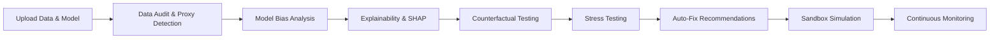

# Unbiased AI Decision Platform

[](https://fastapi.tiangolo.com/)
[](https://reactjs.org/)
[](https://vitejs.dev/)
[](https://www.python.org/)

**A fairness‑guardian platform that audits datasets and ML models for bias, simulates fixes, and monitors fairness after deployment.**

Unbiased AI Decision Platform is an end-to-end fairness-guardian workflow for auditing datasets and models. It helps data scientists and analysts uncover where bias hides, how bad it is, and suggests concrete fixes. It allows you to simulate mitigation strategies in a sandbox, track fairness after deployment, and present results in a single navigation shell designed for fast review.

---

## 📸 Screenshots

*(Add screenshots here after capture)*

---

## 🚀 Quick Start

### Prerequisites
- Node.js (v18+)
- Python (3.10+)

### 1. Start the Backend
```bash
cd backend
python -m venv .venv
source .venv/bin/activate  # On Windows use: .venv\Scripts\activate
pip install -r requirements.txt
python utils/synthetic_data.py  # Generate synthetic demo datasets
uvicorn main:app --reload
```
The backend will run at `http://localhost:8000`.

### 2. Start the Frontend
```bash
cd frontend
npm install
npm run dev
```
The frontend will run at `http://localhost:5173`.

---

## 🏗 Architecture Overview

The system follows a linear fairness workflow:



The frontend (Vite + React + TypeScript) calls the FastAPI backend through the `/api` proxy. The backend stores audit and monitoring results in SQLite for local development and serves the demo datasets so the full pipeline can run without manual file uploads.

---

## ✨ Features

- **Data Audit & Feature Intelligence:** Scans datasets for group representation, class imbalances, missing data, and hidden proxy features (e.g., zip code acting as a proxy for race/caste).
- **Model Bias Analysis:** Calculates advanced fairness metrics across protected groups using `fairlearn`.
- **Explainability:** Uses SHAP values to explain individual flagged decisions and highlight if proxy features influenced the outcome.
- **Counterfactual Testing:** Flips sensitive attributes (e.g., changing gender from Male to Female) to see if the model's decision flips.
- **Stress Testing:** Automatically tests the model's robustness against under-sampling, label noise, and distribution shifts.
- **Auto-Fix Sandbox:** Recommends targeted fixes (like removing a proxy feature or resampling) and simulates the fairness vs. accuracy trade-off in a sandbox.
- **Real-Time Monitoring:** Tracks the fairness score over time after deployment and triggers alerts if fairness drops below baseline.

---

## 🧪 Demo Mode

To run the platform without your own data, use the **Upload page's `Load Demo Project`** action. This fetches the synthetic loan dataset generated by the backend, prefills the required fields, and starts the audit workflow.

**Demo Loan Dataset Configurations:**
- `sensitive_cols` = `["gender", "caste"]`
- `target_col` = `"approved"`
- `domain` = `"loan"`

*Synthetic datasets are pre-configured with baked-in bias to demonstrate the platform's detection capabilities.*

---

## 📊 Fairness Metrics Used

- **Demographic Parity Difference:** The gap between the highest and lowest selection rates across groups.
- **Equal Opportunity Difference:** The gap between true positive rates across groups.
- **False Positive Rate (FPR) Gap:** The gap between false positive rates across groups.
- **Fairness Score:** A 0-100 composite score derived from the three gaps above. A score of 100 means perfectly fair; 0 means maximum detected bias.
- **Counterfactual Flip Rate:** The percentage of decisions that change when only one sensitive attribute changes.
- **Stress Fragility:** Indicates whether fairness drops significantly under controlled perturbations.

---

## 🛠 Tech Stack

**Backend:**
- Python 3
- FastAPI
- Pandas & NumPy
- Scikit-Learn & Fairlearn
- SHAP (Explainability)
- SQLAlchemy (SQLite)

**Frontend:**
- React 18
- TypeScript
- Vite
- Recharts (Data Visualization)
- Radix UI & Lucide React (Components/Icons)
- React Router DOM

---

## 📁 Project Structure

```text
unbiased-ai/
├── backend/                  # FastAPI Application
│   ├── core/                 # Business logic for fairness analysis
│   ├── models/               # SQLAlchemy DB Models & Pydantic Schemas
│   ├── routers/              # API Endpoints
│   └── utils/                # Helper scripts (e.g., Synthetic data generator)
├── frontend/                 # Vite + React + TS Application
│   ├── src/
│   │   ├── api/              # Axios API Client
│   │   ├── components/       # Reusable UI Components
│   │   ├── pages/            # Application Pages
│   │   └── styles/           # Global CSS and Design System
├── data/                     # Generated Synthetic Datasets
└── PROMPT.md                 # Original architecture and development spec
```

---

*Built for fairness, transparency, and accountability in AI decision-making.*
