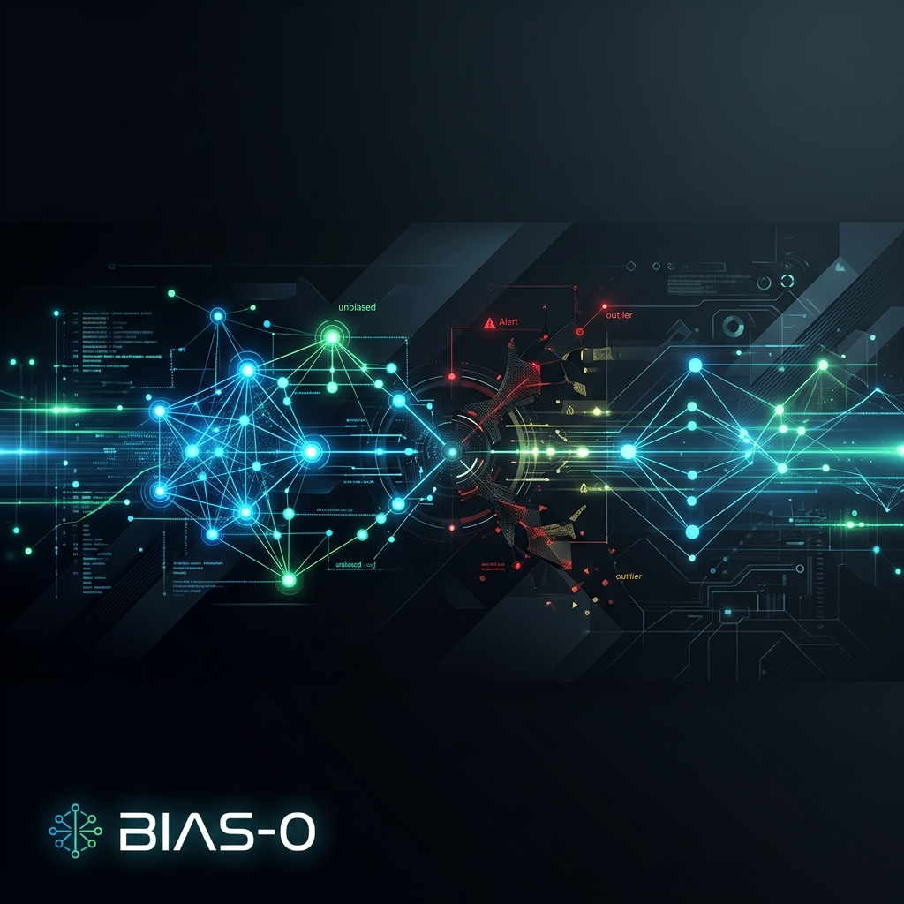

# ⚖️ BIAS-0: The Fairness Guardian for AI



[](https://fastapi.tiangolo.com/)
[](https://reactjs.org/)
[](https://vitejs.dev/)
[](https://www.python.org/)

**Audit. Analyze. Mitigate. Monitor.**  
BIAS-0 is a comprehensive, end-to-end fairness assurance platform designed to help data scientists and AI engineers detect, understand, and resolve bias in their datasets and machine learning models.

---

## 🌟 Core Value Proposition

In the era of AI-driven decision-making, fairness is not just an ethical requirement but a business necessity. **BIAS-0** provides the technical infrastructure to ensure your models are accountable, transparent, and equitable across all demographic groups.

- **Uncover Hidden Bias**: Detect proxy features that leak sensitive information.
- **Explainable Decisions**: Understand *why* a model might be biased using SHAP-based explainability.
- **Risk Mitigation**: Simulate fixes in a safe sandbox before deployment.
- **Continuous Monitoring**: Track fairness drift in production with real-time alerts.

---

## 🏗 Platform Architecture

The system follows a rigorous, linear fairness workflow to ensure no bias goes undetected:

```mermaid
graph TD
    A[📤 Upload Data & Model] --> B[🔍 Data Audit & Proxy Detection]
    B --> C[⚖️ Model Bias Analysis]
    C --> D[💡 Explainability & SHAP]
    D --> E[🔄 Counterfactual Testing]
    E --> F[🧪 Stress Testing]
    F --> G[🛠 Auto-Fix Recommendations]
    G --> H[🏗 Sandbox Simulation]
    H --> I[📡 Continuous Monitoring]
    
    style A fill:#1e2533,stroke:#4f8ef7,stroke-width:2px
    style I fill:#1e2533,stroke:#22c55e,stroke-width:2px
```



---

## ✨ Key Features

| Feature | Description |
| :--- | :--- |
| **🔍 Data Audit** | Scans for group representation, class imbalances, and missing data severity. |
| **🕵️ Proxy Detection** | Identifies features (like ZIP codes) that act as proxies for sensitive attributes. |
| **⚖️ Bias Metrics** | Calculates Demographic Parity, Equal Opportunity, and FPR gaps using `fairlearn`. |
| **💡 Explainability** | SHAP-powered local explanations for decisions that appear biased. |
| **🔄 Counterfactuals** | Tests if changing *only* a sensitive attribute flips the model's decision. |
| **🧪 Stress Testing** | Evaluates model robustness against distribution shifts and minority under-sampling. |
| **🏗 Sandbox** | Interactive simulation to visualize the trade-off between Accuracy and Fairness. |
| **📡 Monitoring** | Real-time fairness tracking with multi-line group breakdown visualizations. |

---

## 📊 Standardized Fairness Metrics

BIAS-0 uses a unified **Fairness Score (0-100)** to provide a clear risk assessment:

- **100**: Perfectly Fair. No detectable bias across demographic groups.
- **75+**: **Low Risk (Green)**. Minor disparities detected.
- **50-74**: **Moderate Risk (Yellow)**. Significant bias identified; monitoring recommended.
- **< 50**: **High Risk (Red)**. Critical bias detected; immediate mitigation required.

---

## 🚀 Quick Start Guide

### 1. Backend Setup
```bash
cd backend
python -m venv .venv
source .venv/bin/activate  # Windows: .venv\Scripts\activate
pip install -r requirements.txt
python utils/synthetic_data.py  # Populate demo datasets
uvicorn main:app --reload
```

### 2. Frontend Setup
```bash
cd frontend
npm install
npm run dev
```

### 3. Demo Mode
Don't have a dataset? Use the **"Load Demo Project"** button on the Upload page to instantly explore the platform using a synthetic loan application dataset with pre-baked bias patterns.

---

## 🛠 Technology Stack

- **Backend**: FastAPI (Python), Pandas, Scikit-Learn, Fairlearn, SHAP, SQLAlchemy (SQLite).
- **Frontend**: React 18, TypeScript, Vite, Recharts, Lucide Icons, Radix UI.
- **Design System**: Custom high-contrast dark theme optimized for data visualization.

---

## 📁 Project Structure

```text
unbiased-ai/
├── backend/                  # FastAPI & Fairness Engines
│   ├── core/                 # Audit, Bias, and Sandbox logic
│   ├── models/               # Database and Schemas
│   └── routers/              # API Endpoints
├── frontend/                 # Vite + React Dashboard
│   ├── src/components/       # Reusable Gauge and Chart components
│   └── src/pages/            # Dashboard, Audit, and Sandbox views
└── data/                     # Synthetic demo datasets
```

---

*Built with ❤️ for a more equitable AI future.*
